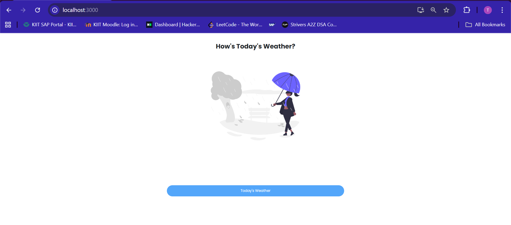
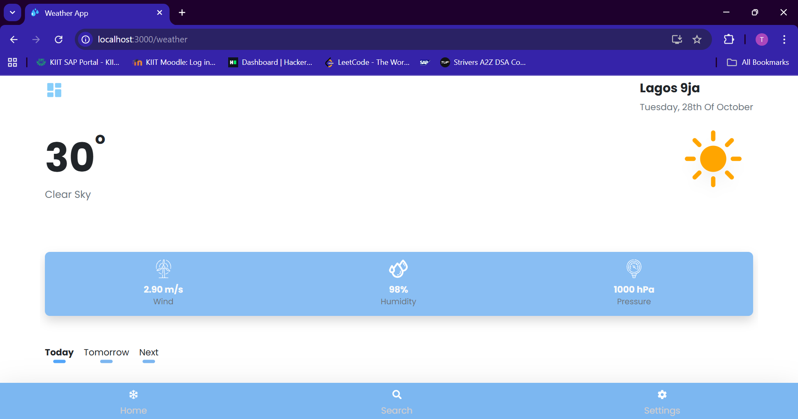
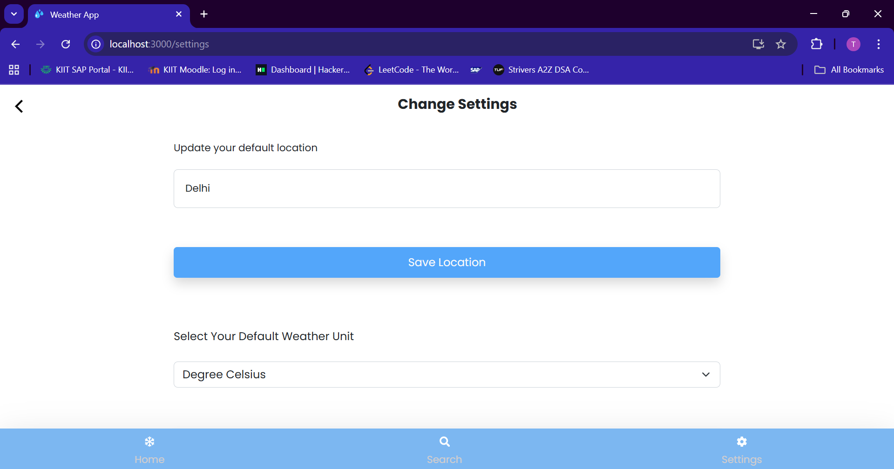

React Weather App
This is a simple weather app built using React. The app displays current weather information for a specified location, such as temperature, humidity, and wind speed.

Installation
To run the app locally, you will need to have Node.js installed on your system. Then, follow these steps:

1.	Clone the repository: git clone    Navigate to the project directory: cd react-weather-app
2.	Install the dependencies: npm install
3.	Start the app: npm start
The app will be available at http://localhost:3000/.

Usage
To use the app, simply enter the name of a city in the search bar and press Enter. The app will display the current weather information for the specified location. The weather data is provided by OpenWeatherMap. 
1.	After starting the app, it will go the home page where you will need to add your default location.
 

 
2.	It will somewhat look like this, to view prediction for next few days click on the logo on left side and click on forecast weather.
3.	With the help of home menu, you can revert back.
4.	By clicking on Search option, we can search for any city.
5.	You can add your preferences in setting tab like default location, weather unit etc.
 
 
 Note- You need to give it location permission when prompt.
Since, it uses Open weather API, generate your own key from https://openweathermap.org/ and paste here 
 

